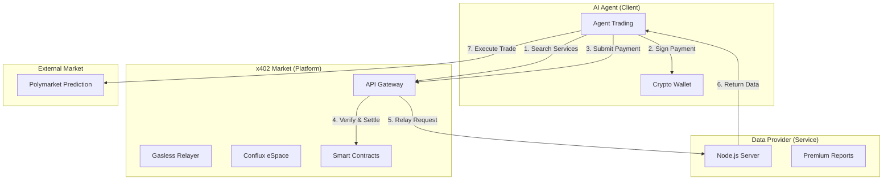

# x402 Ecosystem & Agent Trading

这是一个集成了去中心化数据市场 (x402-market)、AI 交易代理 (agent-trading) 和数据提供商 (x402-data-provider) 的完整生态系统演示。

## 🌟 项目概览

该项目演示了未来 AI Agent 如何在去中心化网络中自主发现服务、支付通过加密货币购买数据，并利用这些数据在预测市场 (Polymarket) 上进行交易。

核心组件包括：

1.  **x402 Market (Platform)**: 基于 Conflux eSpace 的去中心化服务市场。处理服务注册、支付网关、和链上结算验证。
2.  **Agent Trading (Client)**: 一个基于 LangChain 的 AI Agent。它能自主搜索市场上的高价值数据，使用加密钱包进行签名支付，并根据数据分析结果在 Polymarket 上自动下单。
3.  **Data Provider (Service)**: 一个独立的数据服务示例。它通过 x402 协议保护其高价值报告，仅对持有有效支付签名的用户开放数据。

## 🏗 系统架构



## 📂 目录结构

```
gwdc/
├── x402-market/           # [核心平台] Next.js 全栈应用
│   ├── contracts/         # Solidity 智能合约 (Escrow, Registry)
│   ├── src/app/api/       # 后端 API 网关
│   └── src/app/dashboard/ # 供应商/用户前端界面
│
├── agent-trading/         # [AI 客户端] Python 交易 Agent
│   ├── agent/             # LangChain 逻辑与工具
│   └── main.py            # CLI 入口
│
├── x402-data-provider/    # [示例服务] Node.js 数据提供商
│   ├── index.js           # Express 服务器
│   └── data/              # 示例高价值报告
│
└── skills/                # 辅助技能与文档库
```

## 🚀 快速开始

按以下顺序启动各个组件以运行完整流程。

### 1. 启动 x402 Market (平台)

这是核心基础设施，必须首先运行。

```bash
cd x402-market

# 安装依赖
npm install

# 配置环境变量
cp .env.example .env
# 确保配置了 RELAYER_PRIVATE_KEY 和数据库 URL

# 初始化数据库
npx prisma migrate dev

# 启动开发服务器
npm run dev
```
*运行在: http://localhost:3000*

### 2. 启动 Data Provider (服务商)

这是一个提供付费数据的外部服务示例。

```bash
cd ../x402-data-provider

# 安装依赖
npm install

# 启动服务
npm start
```
*运行在: http://localhost:4000*

### 3. 运行 Agent Trading (AI 客户端)

这是执行购买和交易逻辑的 AI。

```bash
cd ../agent-trading

# 安装依赖
pip install -r requirements.txt

# 配置环境变量 (关键)
cp .env.example .env
# 需要配置:
# - OPENAI_API_KEY (用于 Qwen/GPT)
# - CLIENT_PRIVATE_KEY (用于 x402 支付)
# - POLY_PRIVATE_KEY (用于 Polymarket 交易)

# 启动 Agent
python -m agent.main
```

## 💡 使用流程演示

1.  **启动 Agent**后，终端会进入交互模式。
2.  **输入指令**: `Analyzing BTC prices for 2026`
3.  **Agent 执行逻辑**:
    *   **搜索**: 查询 x402 Market 寻找相关服务。
    *   **发现**: 找到 `BTC Q1 2026 Analysis` 报告（由 Data Provider 提供）。
    *   **支付**: 识别该报告需要付费 ($2.00)。Agent 自动生成支付签名。
    *   **获取**: 通过网关提交签名，获取解密后的报告内容。
    *   **决策**: 分析报告内容（例如看涨），决定在 Polymarket 买入。
    *   **交易**: 调用 Polymarket 接口下单。

## 🔧 核心组件详解

### x402 Smart Contracts
位于 `x402-market/contracts`，部署在 Conflux eSpace。
*   **X402ServiceRegistry**: 注册服务元数据（URL、价格）。
*   **X402Escrow**: 托管用户资金，处理支付结算。
*   **X402PaymentProcessor**: 验证 EIP-712 签名。

### Agent Tools
位于 `agent-trading/agent/tools.py`。
*   `list_services`: 发现可用服务。
*   `execute_service`: 处理支付握手并调用服务。
*   `market_buy`: Polymarket 下单接口。

## ⚠️ 常见问题

*   **端口冲突**: 确保 3000 (Market) 和 4000 (Provider) 端口未被占用。
*   **支付失败**: 检查 `CLIENT_PRIVATE_KEY` 对应的钱包在 Conflux eSpace Testnet 是否有足够的测试币。
*   **Polymarket API**: 如果没有真实的 Polymarket API Key，Agent 会使用模拟模式 (Mock Mode)。
