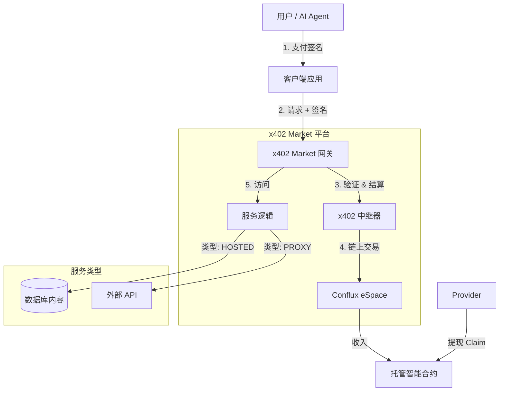

# x402 Marketplace

基于 **x402 协议** 构建的全球数据与算力交易市场。

x402 Market 是一个去中心化平台，用户可以使用加密货币（CFX/mUSDC）将 API 和数据变现。平台内置统一网关，负责处理支付、验证和请求代理，让服务提供商**无需修改代码**即可实现商业化。


## 🌟 核心功能

### 服务提供商 (Providers)
- **托管数据 (Hosted Data)**：直接上传文本/JSON 数据到平台。我们为您托管，并设置付费门槛。
- **代理 API (Proxy API)**：连接任何现有的 REST API。平台作为付费网关，自动拦截未付费请求。
- **零代码集成**：无需安装 SDK 或更改您的业务代码。
- **收益仪表盘**：实时追踪收入，查看访问日志，并随时提取资金（Claim）到您的钱包。

### 用户 / AI Agent
- **AI Agent 原生支持**：完全符合 OpenAI Plugin 标准 (`/.well-known/ai-plugin.json`)，让 ChatGPT 等 AI 直接调用您的服务。
- **无 Gas 支付**：支持 EIP-712 / EIP-3009 签名。用户只需支付代币，由中继器（Relayer）代付 Gas 费。
- **统一发现**：按类型（托管、代理、原生 API）和标签浏览服务。

## 🏗 系统架构

本项目基于 Conflux eSpace 构建，采用现代技术栈。



### 技术栈
- **前端/后端**: Next.js 14 (App Router), React, Tailwind CSS
- **数据库**: SQLite (开发环境) / PostgreSQL (生产环境), Prisma ORM
- **区块链**: Conflux eSpace (EVM 兼容)
- **合约**: Solidity (Escrow, PaymentProcessor, Registry)
- **工具**: Hardhat, Wagmi, Ethers.js v6

## 📂 项目结构

```
x402-market/
├── contracts/               # 智能合约与 Hardhat 环境
│   ├── contracts/           # Solidity 源码 (Escrow, Processor)
│   └── scripts/             # 部署脚本
├── prisma/                  # 数据库架构与迁移
│   └── schema.prisma        # 数据模型 (Service, Provider, AccessLog)
├── public/                  # 静态资源 (图片, Logo)
├── scripts/                 # 实用脚本 (如更新 Agent 文档)
└── src/
    ├── app/                 # Next.js App Router
    │   ├── api/             # 后端 API 路由
    │   │   ├── agent/       # AI Agent 端点
    │   │   ├── claim/       # 收益提现
    │   │   ├── gateway/     # 统一服务网关 (核心)
    │   │   ├── services/    # 服务管理
    │   │   └── revenue/     # 统计与收益
    │   ├── dashboard/       # 提供商仪表盘
    │   ├── service/         # 服务详情页
    │   └── submit/          # 发布服务页面
    ├── components/          # React 组件 (ServiceGrid, WalletButton)
    └── lib/                 # 共享工具类 (Relayer, Prisma, Wagmi)
```

## 🚀 快速开始

### 前置条件
- Node.js v18+
- 安装了 MetaMask 的浏览器，配置好 Conflux eSpace Testnet

### 1. 安装
```bash
git clone https://github.com/jhchong0405/x402_marketplace.git
cd x402-market
npm install
```

### 2. 环境配置
复制 `.env.example` 为 `.env` 并配置：

```env
# 数据库
DATABASE_URL="file:./dev.db"

# 区块链 (Conflux eSpace Testnet)
CONFLUX_RPC_URL=https://evmtestnet.confluxrpc.com
RELAYER_PRIVATE_KEY=your_private_key  # 用于代付 Gas 费
NEXT_PUBLIC_WALLETCONNECT_PROJECT_ID=your_id

# 合约地址 (已部署在测试网)
PAYMENT_PROCESSOR_ADDRESS=0x...
ESCROW_ADDRESS=0x...
MOCK_USDC_ADDRESS=0x...
```

### 3. 数据库设置
```bash
npx prisma migrate dev
```

### 4. 启动开发服务器
```bash
npm run dev
# 应用将运行在 http://localhost:3000
```

## 📖 使用指南

### 发布服务
1. 在首页连接钱包。
2. 点击 **"Submit Service"**（发布服务）。
3. 选择类型：
   - **Upload Data**：直接粘贴文本内容。
   - **Connect API**：输入您的 API 地址。
4. 设置价格（例如 1 mUSDC）。
5. 提交！

### 变现与提现 (Claim)
1. 进入 **Dashboard**（仪表盘）。
2. 查看 **Total Earnings**（总收入）和 **Claimable Balance**（可提现余额）。
3. 点击 **Claim** 按钮将收益提取到您的钱包。
   - *注意：需要有用户付费产生收益后才可提现。*

### AI Agent 集成
让 AI 发现您的服务：
1. 确保您的服务处于激活状态。
2. AI Agent 会通过 `/.well-known/ai-plugin.json` 自动发现服务。
3. 插件清单地址：`https://your-domain.com/.well-known/ai-plugin.json`。

## 📄 许可证
MIT
